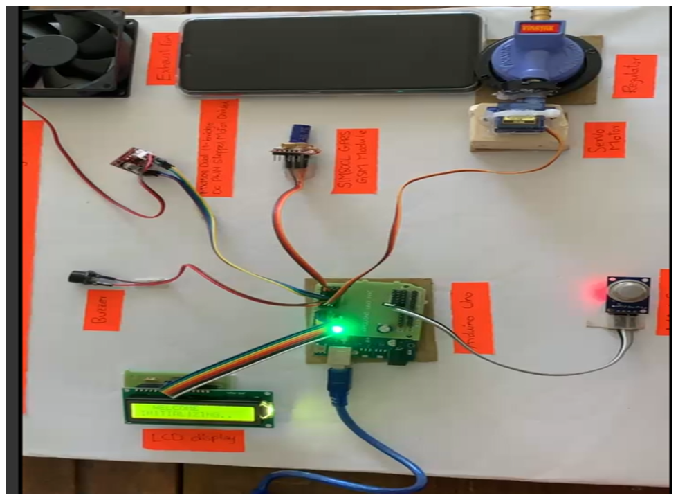
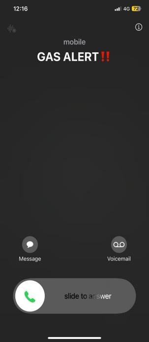
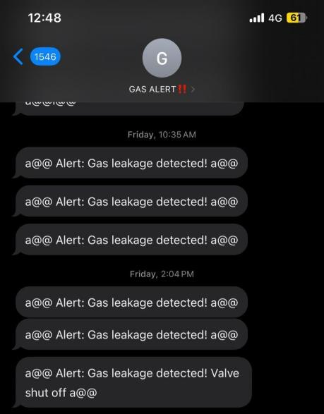
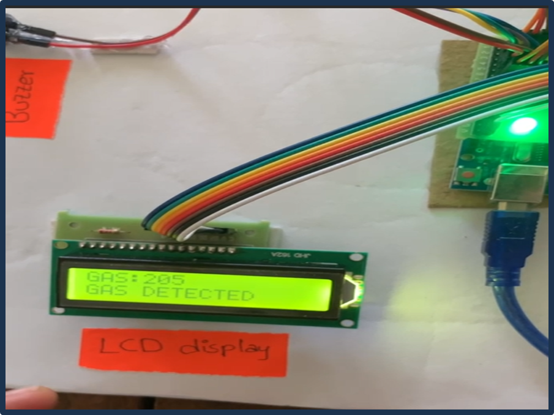

# 🧠 Advanced LPG Gas Leak Detection & Alert System  

A **smart LPG gas leakage detection and prevention system** built using **Arduino Uno**, **MQ-5 gas sensor**, **SIM800L GSM module**, **Servo motor**, **Relay-controlled exhaust fan**, **LCD**, and **Buzzer**.  
It automatically detects gas leaks, triggers alarms, shuts off the valve, starts exhaust fan, and sends SMS/call alerts for emergency response.

---

## ⚙️ Features

✅ Real-time gas concentration monitoring  
✅ Automatic valve closure & fan activation  
✅ GSM-based SMS & call alerts  
✅ Visual (LCD) and audible (buzzer) alarms  
✅ Compact, low-cost, and reliable solution  

---

## 🧩 Hardware Overview

  
*(Connection overview: MQ-5 → A0, Servo → D9, Buzzer → D10, Relay → D11, SIM800L → pins 7/8, LCD → 12,5,4,3,2,6)*  

| Component | Description | Pin Connection |
|------------|--------------|----------------|
| **MQ-5 Gas Sensor** | Detects LPG, butane, propane | A0 |
| **SG90 Servo Motor** | Controls gas valve | D9 |
| **Buzzer** | Local alert | D10 |
| **Relay + Fan** | Activates exhaust fan | D11 |
| **SIM800L GSM Module** | SMS/Call alert system | RX/TX on 7/8 |
| **16x2 LCD** | Displays status messages | 12,5,4,3,2,6 |

---

## 🧠 Working Principle

1. **MQ-5** detects LPG presence → analog voltage rises.  
2. Once threshold (`gasThreshold`) is exceeded →  
   - Servo **closes** the valve.  
   - Relay **turns ON** the exhaust fan.  
   - Buzzer **activates** and LCD shows warning.  
   - **SIM800L** sends an SMS + call to registered phone numbers.  
3. When gas concentration drops → system resets to safe state.

---

## 💻 Setup Instructions

### 🔧 Hardware
- Connect all components as per the wiring diagram above.
- Use **separate 3.7–4.2V, 2A power supply** for SIM800L module.
- Ensure **common GND** between all modules.

### 🧩 Software
1. Open `code/GasLeakDetector.ino` in Arduino IDE.  
2. Select **Tools → Board → Arduino Uno**.  
3. Upload the code to your board.  
4. Replace the placeholder phone numbers with your real ones.

### 🔬 Calibration
1. Let the MQ-5 sensor heat for 20–30 minutes.  
2. Note the sensor’s analog value in clean air (`analogRead(A0)`).  
3. Expose to a controlled gas leak sample, record new reading.  
4. Adjust `gasThreshold` between clean and detected levels.

---

## 📱 SMS / Call Alert Example
Example alert message sent via SIM800L:

⚠ Alert: Gas leakage detected! Valve shut off ⚠

You will also receive a **call** from the module for immediate attention.

---

## 📂 Project Structure

advanced-lpg-gas-leak-detector/
├── code/
│ └── GasLeakDetector.ino
├── hardware/
│ ├── schematics.jpg
│ └── BOM.csv
├── docs/
│ └── documentation.pdf
├── images/
└── README.md

---

## 📸 Example Gallery

| Call Alert | SMS Notification | LCD Display |
|--------------------|-----------------|--------------|
|  |  |  |

---

## 🌐 Connect & Contribute

💡 Pull requests and forks are welcome!  
If you’d like to add IoT integration (Blynk, MQTT, etc.), open an issue.

📧 Contact: `sanjanamoulyakanuri@gmail.com`  

